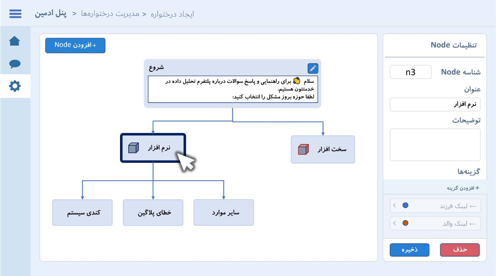
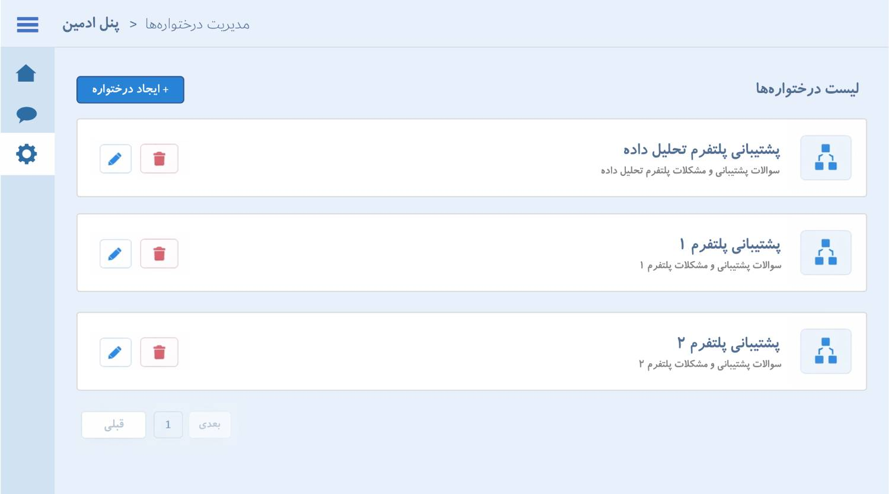

# سند نیازمندی‌های دستیار کاربر پلتفرم تحلیل داده

نسخه: ۱.۰  
تاریخ سند مبنا: ۱۴۰۴/۰۷/۲۶

## ۱. هدف

سامانه باید در زمان بروز خطا یا نیاز به راهنمایی، کاربر پلتفرم تحلیل داده را
به‌صورت مرحله‌به‌مرحله هدایت کند. در صورت حل نشدن مشکل، امکان ثبت خودکار تیکت
پشتیبانی از طریق API سهند/Jira در نظر گرفته می‌شود.

## ۲. دامنه نسخه اول

- وب‌اپلیکیشن مستقل و راست‌چین فارسی
- اجرای داخلی بدون وابستگی به اینترنت
- FAQ ساختاریافته به شکل درخت تصمیم، بدون هوش مصنوعی
- پوشش موضوعات نرم‌افزار، زیرساخت، دیتابیس و حوزه‌های قابل توسعه
- پنل مدیریت برای نگهداری FAQ و مشاهده گزارش کاربران
- رابط کاربری ساده، سریع و قابل فهم

## ۳. نقش‌ها

- کارفرما و مالک پلتفرم تحلیل داده
- مدیر سامانه و نگهدارنده محتوای FAQ
- کاربر نهایی شامل کارمندان و متخصصان فنی
- تیم توسعه
- تیم پشتیبانی فنی

## ۴. نیازمندی‌های کارکردی

### FR-01: احراز هویت

سامانه باید کاربر را با نام کاربری احراز هویت کند. روش نهایی احراز هویت سازمانی
پس از دریافت مستندات کارفرما تعیین می‌شود.

### FR-02: مدیریت درخت‌های FAQ

مدیر باید بتواند چند درخت راهنما ایجاد، مشاهده، ویرایش و حذف کند. هر درخت شامل
عنوان، توضیح، وضعیت فعال و گره شروع است.

### FR-03: مدیریت گره‌ها

مدیر باید بتواند گره ایجاد، ویرایش، حذف و به والد متصل کند. هر گره می‌تواند شامل
عنوان، متن راهنما، پاسخ نهایی و چند گزینه برای انتقال به گره فرزند باشد.

### FR-04: هدایت مرحله‌ای کاربر

کاربر باید مسیر را از گره شروع طی کند، گزینه‌ها را انتخاب کند، پاسخ کوتاه و روشن
دریافت کند و در هر مرحله امکان شروع مجدد گفتگو را داشته باشد.

### FR-05: ثبت پرسش و گزارش

پرسش، مسیر طی‌شده، پاسخ نهایی و وضعیت حل مسئله باید برای گزارش مدیر ثبت شوند.
رفتار ارسال پرسش جدید و امکان تایپ آزاد پس از تصمیم کارفرما نهایی می‌شود.

### FR-06: API سهند/Jira

در صورت حل نشدن مشکل، سامانه باید قابلیت ساخت تیکت از طریق API سهند/Jira را
داشته باشد. بعد از ثبت باید شماره تیکت داخلی، شماره پیگیری داخلی و در صورت
ارسال موفق، شماره تیکت و شماره پیگیری سامانه مقصد به کاربر نمایش داده شود. نوع
تیکت، فیلدهای اجباری و روش احراز هویت (`Token`، `Basic Auth` یا `OAuth`) وابسته
به مستندات و دسترسی کارفرما است.

### FR-07: ورود محتوای FAQ

مدیر باید بتواند FAQ را دستی و از فایل Excel وارد کند. ساختار فایل باید والد،
فرزند، ترتیب گزینه‌ها و پاسخ نهایی را بدون ابهام مشخص کند.

## ۵. نیازمندی‌های غیرکارکردی

- جلوگیری از دسترسی غیرمجاز و حفاظت از اطلاعات
- طراحی ماژولار، خوانا، تست‌پذیر و قابل توسعه
- عملکرد روان و واکنش سریع
- رابط واکنش‌گرا، راست‌چین و دسترس‌پذیر
- ثبت رخدادهای مهم و خطاهای یکپارچه‌سازی
- مستندسازی تغییرات و تصمیم‌ها در مخزن پروژه

## ۶. محدودیت‌ها و وابستگی‌ها

- نسخه اول فاقد هوش مصنوعی است.
- محیط اجرا داخلی، آفلاین و بدون اینترنت است.
- اتصال Jira نیازمند API و دسترسی معتبر کارفرما است.
- صحت درخت به داده و محتوای تأییدشده کارفرما وابسته است.

## ۷. معیارهای پذیرش

- مدیر بتواند یک درخت و گره‌های آن را بدون تغییر مستقیم داده‌ها مدیریت کند.
- کاربر از گره شروع تا پاسخ نهایی، مسیر FAQ را کامل طی کند.
- کاربر در هر مرحله بتواند گفتگو را از ابتدا آغاز کند.
- مسیر و نتیجه گفتگو در گزارش مدیر دیده شود.
- رابط کاربری در اندازه‌های رایج خوانا و بدون خطای عملکردی باشد.
- پس از دریافت تنظیمات API سهند/Jira، یک تیکت آزمایشی با موفقیت ساخته شود و
  شماره تیکت و شماره پیگیری نمایش داده شود.

## ۸. موارد نیازمند شفاف‌سازی

1. محیط نهایی اجرا و روش استقرار
2. سرویس احراز هویت و اعتبارسنجی نام کاربری
3. مشخصات Jira، فیلدهای اجباری و روش احراز هویت
4. مالک محتوا و فرآیند تأیید و انتشار FAQ
5. روش تست، تحویل، مخزن Git و محیط هدف
6. میزان انطباق طراحی نهایی با نمونه اولیه کارفرما
7. امکان تایپ آزاد، ثبت پرسش جدید و نحوه نمایش تاریخچه

## ۹. تصاویر مرجع

تصاویر زیر مرجع جریان و چیدمان هستند؛ زبان بصری نهایی سامانه همان طراحی کریستالی
و سیستم رنگ فعلی پروژه خواهد بود.

